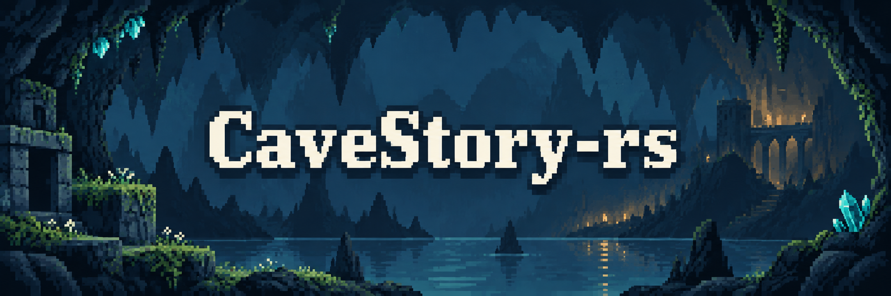
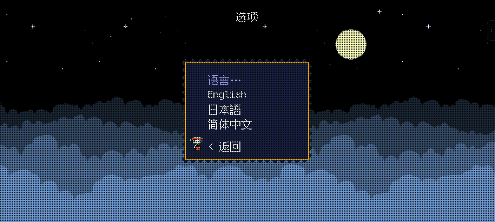
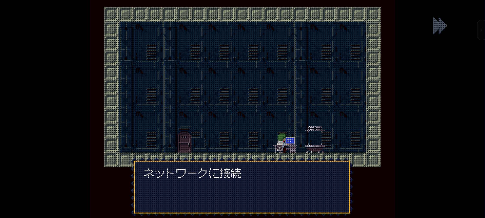
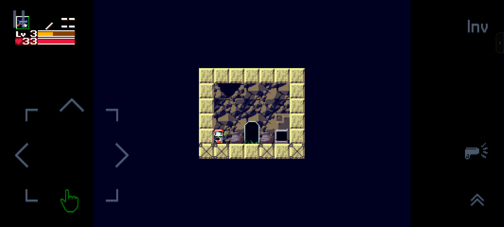
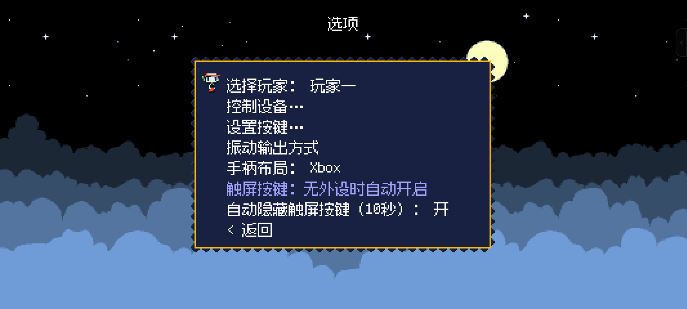

<p align="center">
  
</p>

<p align="center">
  <strong>もう一度、洞窟へ。好きな遊び方で。</strong><br>
  三つの言語 · 独自のコントローラー対応 · Windows &amp; Android
</p>

<p align="center">
  <a href="../README.md">English</a> · <a href="README_zh-CN.md">简体中文</a> · <a href="README_ja-JP.md">日本語</a>
</p>

<p align="center">
  
  
  
  <a href="../LICENSE"></a>
</p>

<p align="center">
  <a href="#features">特徴</a> · <a href="#screenshots">ゲーム画面</a> · <a href="#play">遊び方</a> · <a href="#build">ビルド</a> · <a href="#credits">謝辞</a>
</p>

CaveStory-rs は、Rust で『洞窟物語』のエンジンを再実装した [doukutsu-rs](https://github.com/doukutsu-rs/doukutsu-rs) を基にするコミュニティフォークです。簡体字中国語・英語・日本語のゲームデータをまとめて利用できるようにし、コントローラー操作、Android の初回起動、セーブデータ管理を改善しています。現在は Windows と Android、および 2004 年公開のフリーウェア版を主な対象としています。

<a id="features"></a>

## 好きなゲームを、もっと遊びやすく

<table>
  <tr>
    <td width="50%" valign="top"><h3>🌐 ゲーム全体を三言語で</h3><p>メニュー、会話、アイテム、マップ、字幕、画像内の文字まで。日本語・English・简体中文を切り替えられます。</p></td>
    <td width="50%" valign="top"><h3>🎮 独自のコントローラー体験</h3><p>Xbox／PSP 配置、カスタム設定、自動割り当て、ホットプラグ、強化した振動効果を用意。</p></td>
  </tr>
  <tr>
    <td width="50%" valign="top"><h3>📳 Shizuku で Bluetooth 振動</h3><p>独自の Android 出力経路で、Shizuku の許可を通じて対応する Bluetooth コントローラーを振動させます。</p></td>
    <td width="50%" valign="top"><h3>📱 起動して、冒険へ</h3><p>同梱 APK はオフラインでデータを準備。システム言語と連動し、周辺機器に応じてタッチボタンを表示します。</p></td>
  </tr>
  <tr>
    <td width="50%" valign="top"><h3>💾 セーブ先を自分で選ぶ</h3><p>Android の専用領域と公開フォルダーに対応。移行はコピーと検証を終えてから切り替え、元データを残します。</p></td>
    <td width="50%" valign="top"><h3>🧩 Trainer と連携</h3><p>別アプリの CaveStory-rs Trainer 用ローカルインターフェースを搭載。有効にするかは自分で選べます。</p></td>
  </tr>
</table>

### コントローラーに、確かな手応えを

**Shizuku を利用した Bluetooth コントローラーの振動。** 通常のアプリ権限では振動を出力できない場合に、Shizuku で許可された Shell サービスから対応する Bluetooth コントローラーへ振動指令を送る経路を開発しました。特に誇りに思っている独自の成果です（もしかすると、前例のない試みかもしれないと思っています）。プレイヤーと機器の正確な対応付け、出力の強さと時間の制限、権限と再接続の処理、バックグラウンド移行時の振動停止まで実装しています。root 化していない Xiaomi Mi 9 を含む検証環境で、実際の振動を確認しています。対応状況は機器、接続方法、OS に依存します。この機能は任意で、通常のプレイに Shizuku は不要です。

<details>
<summary><strong>機能の詳細を見る</strong></summary>

- **メニューとゲームデータをまとめて三言語に切り替え。** 簡体字中国語・英語・日本語を選ぶと、会話、アイテム説明、マップ名、エンディングの字幕、関連する画像内の文字も切り替わります。言語別ディレクトリ、文字コード対応、中国語・日本語用のピクセルフォントにより、同じインストール先で三言語を扱えます。全シナリオの逐文校正は引き続き必要です。
- **独自に設計・実装したコントローラー対応と振動。** 自動割り当てとホットプラグの改善、Xbox／PSP のボタン配置プリセット、保持されるカスタム設定、強化したゲーム内振動を実装しています。キーボード、タッチ入力、プレイヤー別の機器割り当ても維持します。振動の初期設定は有効・強化方式ですが、保存済みの設定を尊重します。Android では振動効果とシステム／Bluetooth の出力方式を分け、振動のプレビューも用意しています。
- **周辺機器に応じたタッチボタン表示。** Android でコントローラーを接続するとタッチボタンを自動的に隠し、対象となる外部入力機器がなくなると表示を戻します。「10 秒間タッチがなければ非表示」は任意設定で、初期状態では無効です。タッチすると再表示され、押し続けている間は隠れません。
- **Android の初回起動を簡単に。** ゲームデータ同梱版は初回起動時にオフラインでデータを準備します。基本版はデータが不足している場合にダウンロードを確認し、キャンセルすると正常に終了します。準備画面とエラー表示は三言語に対応し、ゲーム用フォントがまだなくても読めます。
- **Android のシステム／アプリ言語との連動。** 新規インストールでは簡体字中国語のロケールなら簡体字中国語、日本語なら日本語、それ以外は現在のところ英語を選びます。ゲーム内で手動選択した言語を保持し、その後システム／アプリ言語を変更した場合は再び反映します。プレイ中に届いた変更はタイトル画面に戻ってから適用し、進行中の状態を守ります。
- **セーブ先の選択と移行。** Android ではアプリ専用領域か、選択したローカルの公開フォルダーを利用できます。公開フォルダーにはセーブ、リプレイ、進行記録を保存し、ゲームデータと端末設定は専用領域に残します。詳細設定からの移行ではコピーと検証を終えてから切り替え、元ファイルを残して競合を明示的に処理します。ホーム画面のアイコンから入り直した際も、実行中のゲームを維持します。
- **任意で利用できるローカル Trainer インターフェース。** Windows と Android には、別途保守される CaveStory-rs Trainer 用のゲーム側インターフェースが含まれます。Windows では `CAVESTORY_TRAINER=1` などによる明示的な有効化、Android では同じ証明書で署名された Trainer を通じたユーザーの許可が必要です。初期状態では接続できません。ゲームは同梱されたインターフェースのソースだけでビルドでき、Trainer アプリは別に管理されます。
- **統一したパッケージと入手元の案内。** 五つのアーキテクチャそれぞれに基本版とゲームデータ同梱版を用意し、アーキテクチャ、データの出典、SHA256 を記録します。Android の入手元アンケートは端末内だけに回答を保存し、ネイティブゲームの起動前にリリース署名を確認します。会話内のリンクは確認後に開きます。単純な再署名・改変への対策ですが、ダウンロード元の証明や、あらゆる改変の防止はできません。

</details>

<a id="screenshots"></a>

## 実際のゲーム画面

本プロジェクトの検証時に保存した Android の実画面です。画像をクリックすると原寸で表示します。

<table>
  <tr>
    <td width="50%"><a href="../res/readme/languages.png"></a><br><sub>一つのインストールで三言語</sub></td>
    <td width="50%"><a href="../res/readme/japanese-dialogue.png"></a><br><sub>ゲーム内の日本語会話</sub></td>
  </tr>
  <tr>
    <td width="50%"><a href="../res/readme/android-gameplay.png"></a><br><sub>Android のタッチ操作</sub></td>
    <td width="50%"><a href="../res/readme/controller-options.png"></a><br><sub>独自のコントローラー・振動設定</sub></td>
  </tr>
</table>

<a id="about"></a>

## このプロジェクトを始めた理由

今使っているさまざまな端末で、読み慣れた言語と使いやすい操作方法で『洞窟物語』を楽しみたい。その思いから始まったプロジェクトです。パソコンではキーボードやコントローラーで、スマートフォンでは手軽に遊べることを目指しています。

その土台を用意してくれたのが doukutsu-rs です。本フォークでは、まず簡体字中国語でゲーム全体を楽しむために必要な対応を進めました。メニューだけでなく、会話、アイテム説明、マップ名、フォント、画像内の文字まで、一緒に扱える必要があったためです。その後、言語データの切り替え、データの準備、コントローラー設定、振動、Android のセーブ管理へと改善を広げてきました。

<a id="comparison"></a>

## オリジナルとの違い

### 2004 年の PC 版との違い

オリジナルの『洞窟物語』は、天谷大輔氏が Pixel 名義で制作したゲームです。CaveStory-rs は、そのゲームデータを doukutsu-rs の Rust エンジンで動かします。現代のシステムへの対応、画面設定、入力のカスタマイズ、Android のタッチ操作などは、上流エンジンの機能を基にしています。

対象となるのは、フリーウェア版の冒険、ドット絵、音楽、ゲームプレイです。そこに多言語データの管理と各プラットフォームでの利便性を加えています。また、内容を確認済みのバルログ初登場時の会話には、入手元についての短い案内を追加しています。そのため、同梱スクリプトには原文への小さな加筆があります。元の場面と戦闘の選択肢は残し、パッチ適用前に元のスクリプトをバックアップします。

現在の対応・検証範囲は、フリーウェア版のデータとその翻訳版です。上流が別のゲーム版やプラットフォームに対応していても、本フォークで Cave Story+、商用リマスター、上流のすべての移植版を検証済みという意味ではありません。

### doukutsu-rs からの改善点

本フォークでは三言語のゲームデータ切り替え、独自のコントローラー・振動対応、Shizuku の Bluetooth 出力、Android の起動とセーブ管理、任意の Trainer 連携をまとめています。追加した成果は上の[特徴一覧](#features)で紹介しています。土台となる Rust エンジンは doukutsu-rs によるものです。

<a id="play"></a>

## 遊び始めるには

現在のローカル配布用ビルド構成は次のとおりです。

| プラットフォーム | アーキテクチャ | 形式 |
| --- | --- | --- |
| Windows | `x86_64` · `x86_32` · `arm64` | ZIP、基本版／`_game` |
| Android | `arm64-v8a` · `armeabi-v7a` | APK、基本版／`_game` |

- **同梱版（`_game`）：**三言語データとフォント、Windows 用の対応ランタイムを含みます。Android はオフラインでデータを準備できます。
- **基本版：**Windows は互換データと対応 Visual C++ ランタイムが必要です。Android は不足データのダウンロードを案内します。

ファイル名は `CaveStory-rs_<platform>_<YYYYMMDD>_<architecture>[_game].zip` または `.apk` です。Android は ABI ごとに別の APK を作成するため、端末の OS が対応するものを選んでください。設定上の最低バージョンは Android 7.0／API 24 ですが、条件を満たすすべての端末で動作確認を行ったわけではありません。

本フォークは [GitHub Releases](https://github.com/TG-Twilight/CaveStory-rs/releases/latest) からダウンロードできます。現在の Release はローカルでビルド・検証したパッケージです。[GitHub Actions](https://github.com/TG-Twilight/CaveStory-rs/actions/workflows/build.yml) は五つのアーキテクチャ、計十パッケージをビルドし、パッケージ検証後に配布用 artifact をアップロードします。Release の自動公開は行いません。設定と取得方法は[ワークフローガイド](CONTRIBUTING.md#github-actions-builds)を参照してください。

### Windows

ゲームデータ同梱版を、書き込み可能なフォルダーにすべて展開し、`CaveStory-rs.exe` を起動します。初期言語は簡体字中国語です。**选项 → 语言**（オプション → 言語）から日本語または English に変更できます。更新や移動の際は、セーブと設定を含む `user/` を残してください。データ抽出用の元の `Doukutsu.exe` と、各言語ディレクトリ内の元の実行ファイルも保持してください。

<details>
<summary><strong>基本版のセットアップと言語データの追加</strong></summary>

基本版には、互換性のあるフリーウェア版データの作業用コピーが必要です。検証済みの中国語版の手順では、同梱の `data/fonts` と `data/locale` を簡体字中国語版のコピーに追加し、`CaveStory-rs.exe` を `Doukutsu.exe` の隣に置きます。既存のセーブやカスタマイズしたファイルを保護してください。

管理対象として認識できる中国語版のインストールには、次のコマンドで英語・日本語データを追加できます。パスは実際の `data` ディレクトリに置き換えてください。既存の言語ディレクトリは上書きから保護されます。

```powershell
py tools/install_english_resources.py --data "C:/Games/CaveStory-rs/data"
py tools/install_japanese_resources.py --data "C:/Games/CaveStory-rs/data"
```

</details>

### Android

対応する ABI の APK をインストールし、データ準備後に専用領域か公開フォルダーを選びます。公開フォルダーはシステムの選択画面が扱うローカルフォルダーに対応し、クラウドや任意の外部ドキュメントプロバイダーには対応していません。専用領域のファイルは、ファイルマネージャーの**ストレージを追加**からゲームのドキュメントプロバイダーを選んで管理できます。

後でセーブを移す場合はタイトル画面に戻り、**オプション → 詳細設定 → セーブの保存先**を開きます。移行後も元ファイルは残ります。別のインストール先や端末に移すときは、別途バックアップも取ってください。

基本版とゲームデータ同梱版のリリース APK は、`io.github.cavestory_rs` と同じ署名を使うため、相互に上書き更新できます。旧 `io.github.doukutsu_rs` アプリや debug 版は保存領域が別で、セーブは自動インポートされません。

### ゲームデータの入手元

データの案内元は [Cave Story Tribute Site](https://www.cavestory.one/download/cave-story.php) です。簡体字中国語訳は Hydrowing、英訳は Aeon Genesis によるもので、日本語のアーカイブは Studio Pixel から取得します。パッケージ作成ツールは使用したアーカイブとハッシュを記録します。同梱版はセットアップを簡単にし、記念サイトから繰り返しダウンロードする負担を減らすためのものです。オリジナルの完全なゲームデータは、ソースリポジトリと基本版には含めません。

ディレクトリ構成と貢献の手順：[コントリビューションガイド](CONTRIBUTING.md)。

<a id="build"></a>

## ビルド方法

必要なビルド手順を開いてください。出力先はリポジトリと同じ親ディレクトリの CaveStory-rs-runs です。

<details>
<summary><strong>ソースとツールの準備</strong></summary>

```sh
git clone --recurse-submodules https://github.com/TG-Twilight/CaveStory-rs.git
cd CaveStory-rs
git submodule update --init --recursive
```

Rust／Cargo、Git、C/C++ ツールチェーン、CMake が必要です。[Cargo.toml](../Cargo.toml) で宣言されている最低 Rust バージョンは 1.88 ですが、記録済みのローカルビルドでは 1.98.1 を使用しており、最低バージョン自体は未検証です。既定のデスクトップバックエンドでは SDL2 をソースからビルドします。データ準備には Python 3 と Pillow も必要です（Windows では `py -m pip install Pillow`）。

出力先はリポジトリと同じ親ディレクトリにある `CaveStory-rs-runs/` です。[.cargo/config.toml](../.cargo/config.toml) で Cargo の出力先を設定済みで、ダウンロードとパッケージ作成用のキャッシュもソースツリー外に置きます。ゲーム側の Trainer 依存関係は `vendor/trainer/` に含まれており、Trainer の別リポジトリは不要です。

</details>

<details>
<summary><strong>Windows エンジンのビルド</strong></summary>

Visual Studio C++ Build Tools と Windows SDK をインストールし、対象アーキテクチャ用に設定した開発者シェルを使用します。CMake が `PATH` にあることも確認してください。x64 エンジンの例です。

```powershell
rustup target add x86_64-pc-windows-msvc
cargo build --release --locked --bin CaveStory-rs --target x86_64-pc-windows-msvc
```

実行ファイルは `../CaveStory-rs-runs/cache/cargo/x86_64-pc-windows-msvc/release/CaveStory-rs.exe` に生成されます。この手順ではエンジンをコンパイルするため、実行時には前述のゲームデータを組み合わせてください。他の Windows target は `i686-pc-windows-msvc` と `aarch64-pc-windows-msvc` で、それぞれ対応する MSVC ツールとライブラリが必要です。

</details>

<details>
<summary><strong>Android のビルド</strong></summary>

現在の構成は JDK 17 互換の環境、SDK 35、Build Tools `35.0.1`、NDK `28.0.13004108`、CMake 3.22 以降を使用します。Gradle wrapper と Android Gradle Plugin のバージョンはリポジトリで指定されています。両方の Rust target を追加してください。

```powershell
rustup target add aarch64-linux-android armv7-linux-androideabi
```

**ビルド前に署名を設定する必要があります。** 現在は Debug と Release の両方で JKS が必要で、標準 debug キーへの自動フォールバックはありません。Gradle は `REVIA_KS_PATH` と `REVIA_KS_PASS` を受け取り、秘密鍵エントリーが一つだけのキーストアを前提に、ストアと鍵に同じパスワードを使用します。保守者の秘密鍵はソースに含まれません。独自ビルドでは自分の鍵を用意し、[SignaturePolicy.java](../platforms/android/app/src/main/java/io/github/cavestory_rs/SignaturePolicy.java) も自分の証明書に合わせて設定してください。設定しない場合、インストール後の起動チェックで拒否されます。再配布する際は、独自ビルドであることを明示してください。

署名用の環境変数と `JAVA_HOME`／`ANDROID_HOME` を設定したら、リポジトリのルートから実行します。

```powershell
cd platforms/android
./gradlew.bat assembleDebug --project-cache-dir ../../../CaveStory-rs-runs/cache/gradle-project --console=plain
cd ../..
```

二つの基本 debug APK が `../CaveStory-rs-runs/cache/android/app/build/outputs/apk/debug/` に生成され、アプリ ID には `.debug` が付きます。リリース構成には `assembleRelease` を使います。ゲームデータを同梱する場合は、まず `py tools/package_windows_with_game.py --android-assets <CaveStory-rs-runs内のディレクトリ>` で検証済みのアーカイブを準備し、そのディレクトリを `-PcaveStoryGameAssets=<ディレクトリ>` として Gradle に渡してください。キャッシュが空の場合、依存関係、フォント、ゲームアーカイブの初回取得にはネット接続が必要です。

</details>

<details>
<summary><strong>全構成のローカルビルド：五アーキテクチャ、十パッケージ</strong></summary>

保守者用のビルドコマンドは次のとおりです。

```powershell
powershell -NoProfile -ExecutionPolicy Bypass -File tools/build_all.ps1
```

`../CaveStory-rs-runs/builds/<batch>/` に Android の二つの ARM APK と Windows の三アーキテクチャの ZIP を生成します。それぞれに基本版とゲームデータ同梱版があり、同じバッチでは日付バージョンを統一します。`build-info.json`、`SHA256SUMS`、`verified-delivery.json` も出力します。

この手順は Windows 環境向けです。別のマシンでは `VSROOT`／`CAVESTORY_ARMTOOLS` で MSVC と ARM64 コンパイラ、`JAVA_HOME`／`ANDROID_HOME` で Android ツールを指定できます。クラウド環境の設定は [setup_ci.ps1](../tools/setup_ci.ps1) を参照してください。元のローカル既定値は維持しています。Android はプロセスの `REVIA_KS_PASS` を優先し、未設定なら Windows の**ユーザー環境変数**を読みます。JKS の場所は `REVIA_KS_PATH` で指定できます。独自配布では、アプリの署名方針と APK 検証スクリプトの証明書指紋を合わせて変更する必要があります。

固定バージョンのフォント・ゲームアーカイブと、Windows の三アーキテクチャに対応する Visual C++ ランタイムも準備してください。[package_windows_with_game.py](../tools/package_windows_with_game.py) と [build_windows.ps1](../tools/build_windows.ps1) に詳細があります。全体の手順では Android の段階でゲームアーカイブとフォントキャッシュを準備してから Windows のパッケージを作成します。コンパイルの成功に加えて、内容の検証と実機テストが必要です。

</details>

<a id="status"></a>

## 現在の制限と検証範囲

Windows x64／x86 と Android ARM64 にはローカルでの動作確認記録があります。Android ARM32 は以前のバッチで実機確認済みですが、全手順の回帰検証は引き続き必要です。Windows ARM64 はビルドと静的検証までで、実機での確認は未実施です。Linux およびその他の上流プラットフォームは、現在の配布用ビルド構成に含まれません。

<details>
<summary><strong>残作業を見る</strong></summary>

今後の作業には、全編クリアとエンディングの検証、全スクリプトの校正、英単語の折り返しと中国語の句読点処理、タッチ式アイテムボタンの `Inv` 表記、コントローラー・振動と Android バージョンの検証拡大、ダウンロード中断からの復帰テスト、音声関連の警告調査、16 KB ページサイズの検証があります。繁体字中国語は今後の課題です。

</details>

<a id="credits"></a>

## あとがき・謝辞

このプロジェクトの出発点は、何より『洞窟物語』です。**天谷大輔氏（Pixel／Daisuke Amaya）**と **[Studio Pixel](https://studiopixel.jp/)** に、心からの敬意と感謝を。登場人物や音楽、細部の一つひとつが、年月を経てもまた帰りたいと思わせてくれます。この取り組みも、そんな作品と、そこに込められた心へのささやかな敬意です。

**[doukutsu-rs のチームと貢献者の皆さん](AUTHORS.md)**、エンジンを公開し、さまざまな環境へ広げ、さらに改良できる土台を作ってくださり、ありがとうございます。本フォークの作業は皆さんの成果に支えられています。ここでの追加対応が、その成果をより多くのプレイヤーに届ける助けになれば幸いです。

翻訳を手がけた Hydrowing と Aeon Genesis、データや資料を保存する Cave Story Tribute Site、ピクセルフォントを提供する [Fusion Pixel](https://github.com/TakWolf/fusion-pixel-font) とその貢献者にも感謝します。上流から引き継いだ AppleHair、Daedliy、ggez、Clownacy、LunarLambda／organism、Zoroyoshi などのクレジットは [AUTHORS.md](AUTHORS.md) に残しています。

> 誰かが手元の端末でゲームを開き、無理なく言葉を読み、『洞窟物語』の世界でもう少し過ごせること。それが、この小さな取り組みの願いです。

<a id="license"></a>

## ライセンスとクレジット

エンジンは上流の著作権表示を保持し、[MIT ライセンス](../LICENSE) で配布します。ゲームデータ、翻訳、フォント、その他の第三者素材には、それぞれの条件と注意書きが適用されます。エンジンのライセンスによって、それらの素材の権利が与えられるわけではありません。Fusion Pixel は SIL Open Font License を使用し、同梱 Trainer の表記は [TRAINER-LICENSES.txt](../vendor/trainer/notices/TRAINER-LICENSES.txt) にあります。サイトからダウンロードできることだけでは、再配布の許諾にはなりません。

CaveStory-rs は Studio Pixel および doukutsu-rs とは独立して保守されるコミュニティプロジェクトです。入手元の案内によって、MIT ライセンスや第三者作品の条件が変更されることはありません。

<p align="center"><sub><a href="../res/readme/ARTWORK.md">カバー：AI 生成イラスト · ギャラリー：実際のゲーム画面 · 画像の出典</a></sub></p>
